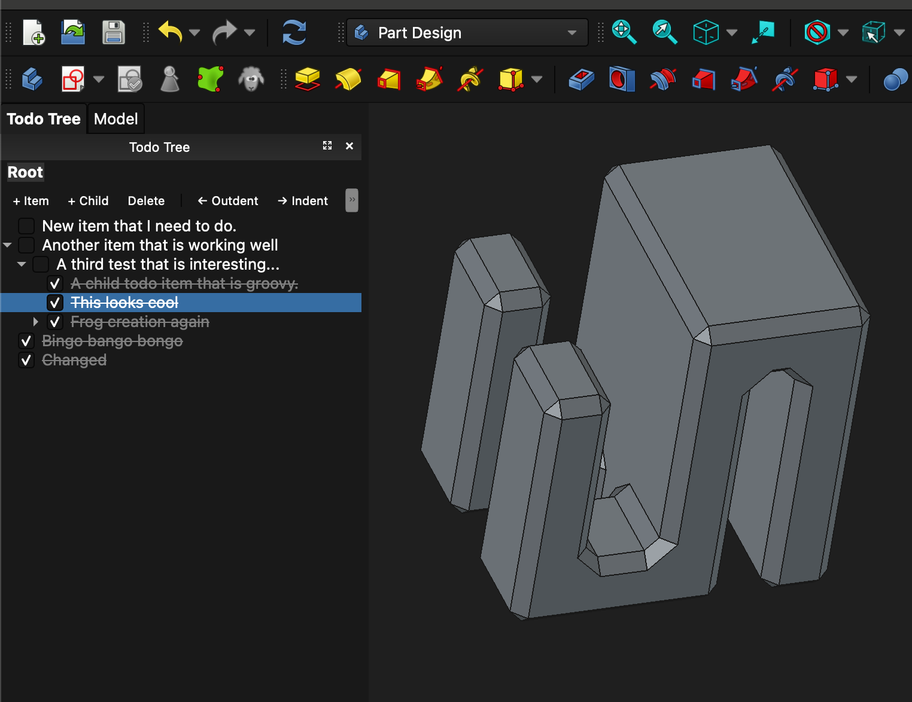

#  Todo Tree Panel

The Todo Tree panel is a persistent dock that displays your todo list
alongside any other workbench. You never have to leave PartDesign or
Sketcher to check or update your tasks.

 

## Preview

*The Todo Tree panel open in the Part Design workbench.*

 

## Opening the panel

The panel is created automatically the first time FreeCAD activates any
workbench after startup. Once it exists it appears in **View → Panels →
Todo Tree** and can be shown or hidden from there.

You can also open it explicitly from the **Todo Tree** workbench or menu:

-   **Show Todo Panel** — shows or raises the dock panel on the left side
    of the screen.

-   **Open Todo Tree View** — opens the todo tree as a full tab in the
    main viewport area, similar to a Spreadsheet or Text Document.
    Double-clicking the `TodoTree` object in the Model tree has the same
    effect.

 

## Persistence across workbenches

The panel stays open regardless of which workbench is active. Switching
to PartDesign, Sketcher, or any other workbench does not hide it.

If you close the panel intentionally (click the × on its title bar) you
can reopen it at any time from **View → Panels → Todo Tree**.

 

## Per-document todos

Each `.FCStd` file has its own independent todo list. When you switch
between open documents the panel automatically switches to show that
document's todos. When no document is open the panel shows a placeholder.
