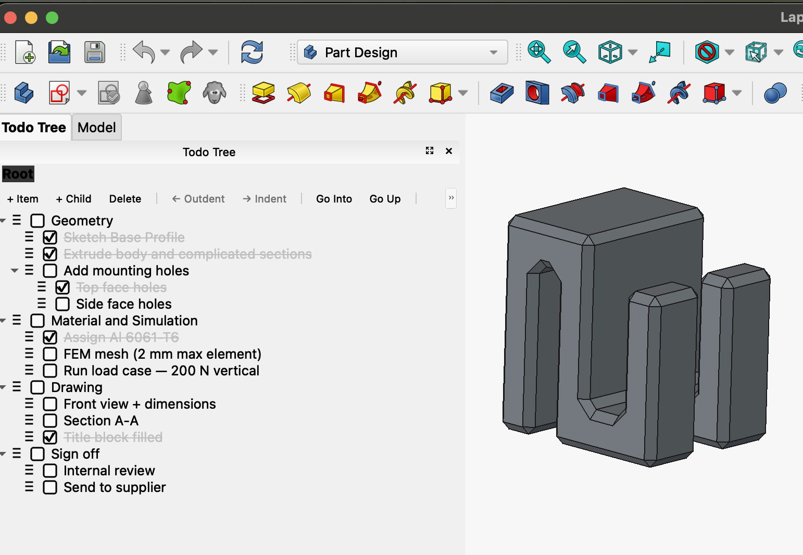
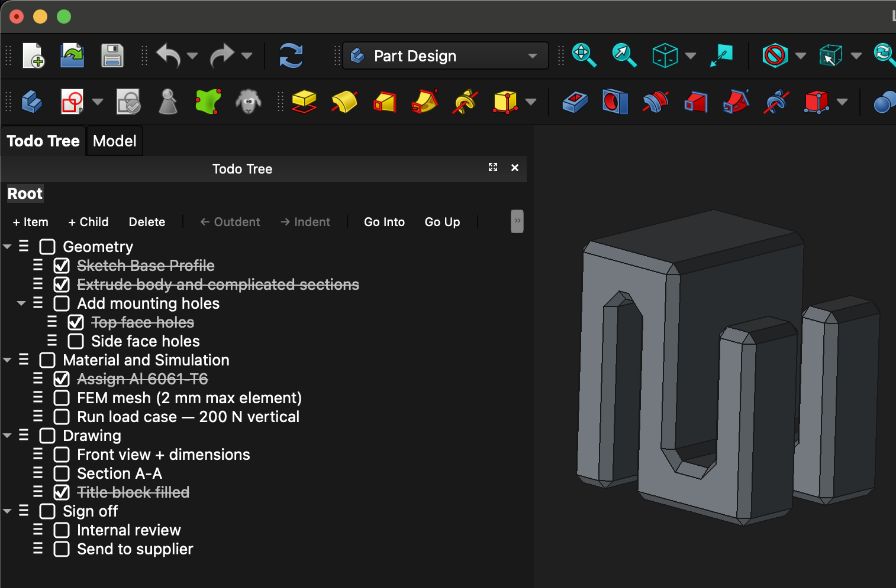

# TodoTree

A FreeCAD workbench that adds a hierarchical, per-document todo list to your `.FCStd` files. Organise tasks in a tree, navigate into subtrees, and pick up exactly where you left off every time you open the file.



*Light mode — Todo Tree dock panel open alongside a PartDesign document.*



*Dark mode — the same panel with FreeCAD's dark theme active.*

## What it is

TodoTree gives you a task list that lives inside your FreeCAD document. Every item can have child items, giving you a tree structure that mirrors the natural hierarchy of a design project — milestones at the top, sub-tasks underneath, and implementation notes below those. The view supports zooming into any subtree so you can focus on one branch without the rest cluttering the screen, with a breadcrumb trail back up to the root.

Key capabilities:

- **Unlimited-depth tree** — any node can have children; no hierarchy cap.
- **Dual view** — a persistent dock panel on the side and a full main-window view that opens like a Spreadsheet or Text Document.
- **Breadcrumb navigation** — click any ancestor in the breadcrumb bar to jump back up the hierarchy; click "Go Into" on any node to make it the current root.
- **Done / not-done checkboxes** — completed items get strikethrough and greyed text; a toolbar toggle hides them entirely.
- **Inline editing** — double-click any item to rename it in place.
- **Full undo/redo** — add, delete, rename, and toggle operations are all on FreeCAD's undo stack (Ctrl+Z / Ctrl+Y).
- **View state persistence** — the breadcrumb position, expanded nodes, and show-done toggle are restored exactly as you left them when you reopen the file.
- **Indent / outdent** — promote or demote any item one level with Tab / Shift+Tab; children always travel with the moved node.
- **Per-document** — each `.FCStd` file has its own independent todo tree; opening multiple documents gives you multiple independent lists.

## Documentation

Full command reference is in the [Documentation](Documentation/README.md) directory.

## How to install

### Via the Addon Manager (recommended)

1. In FreeCAD, open **Tools → Addon Manager**.
2. Search for **TodoTree**.
3. Click **Install**, then restart FreeCAD.

The workbench will appear in the workbench selector after restart.

### Manual installation

1. Find your FreeCAD user `Mod` directory:
   - **Linux / macOS:** `~/.local/share/FreeCAD/Mod/` or `~/.FreeCAD/Mod/`
   - **Windows:** `%APPDATA%\FreeCAD\Mod\`
   - Or check **Edit → Preferences → General → Macro path** for your user directory.
2. Clone or download this repository into that folder:
   ```
   cd ~/.local/share/FreeCAD/Mod
   git clone https://github.com/robertmassaioli/freecad-todo-tree TodoTree
   ```
3. Restart FreeCAD.

### Symlink install (macOS / Linux — recommended for development)

If you are working on the addon or want FreeCAD to pick up changes without reinstalling, symlink your checkout into the `Mod` directory instead of copying it. FreeCAD follows the symlink at startup so edits to the source tree are reflected immediately on the next launch.

```bash
# Clone the repo wherever you keep your projects
git clone https://github.com/robertmassaioli/freecad-todo-tree ~/projects/freecad-todo-tree

# Create the symlink (adjust the Mod path for your OS if needed)
ln -s ~/projects/freecad-todo-tree ~/.local/share/FreeCAD/Mod/TodoTree
```

On macOS, FreeCAD's `Mod` directory is typically inside the application support folder:

```bash
ln -s ~/projects/freecad-todo-tree \
  ~/Library/Application\ Support/FreeCAD/Mod/TodoTree
```

Restart FreeCAD once after creating the symlink. From then on, a `git pull` in your checkout is all that's needed to update the addon — no reinstall required.

**Requirements:** FreeCAD 1.0.2 or later (Python 3.8+, PySide2 or PySide6).

## How to use

### Opening the todo panel

Switch to the **Todo Tree** workbench from the workbench selector. The dock panel opens automatically on the left side of the screen. You can also reopen it at any time with **Todo Tree → Show Todo Panel** from the menu or toolbar.

**The dock panel persists across workbench switches.** Once opened, it stays visible regardless of which workbench is active — you can work in PartDesign, Sketcher, or any other workbench and your todo list remains in view. This works because the dock is added directly to FreeCAD's main window outside the per-workbench dock management system, so workbench switches do not affect it.

If you manually close the dock (by clicking the X on the panel), it will not reappear automatically when switching workbenches. Switch back to the **Todo Tree** workbench, or use **Todo Tree → Show Todo Panel**, to bring it back.

To open the full main-window view (like a Spreadsheet tab), use **Todo Tree → Open Todo Tree View**, or double-click the `TodoTree` object in the model tree.

### Adding items

- **+ Item** — adds a new item at the same level as the current selection. If nothing is selected, the item is added at the top of the current view root.
- **+ Child** — adds a child item under the current selection. If nothing is selected, a child is added under the current view root.

New items open immediately in inline-edit mode so you can type the label straight away. Press Enter or click elsewhere to confirm; press Escape to cancel.

### Completing items

Click the checkbox next to an item to mark it done. Done items appear with strikethrough grey text. Use the **Show Done** toggle button to hide or reveal all completed items.

When a done item is hidden, its entire subtree is hidden with it. Mark the item not-done to make the subtree visible again.

### Navigating the hierarchy

- **Go Into** — makes the selected item the root of the view. The breadcrumb bar updates to show the path back to the top.
- **Go Up** — moves the view root one level up.
- **Breadcrumb clicks** — click any ancestor label in the breadcrumb bar to jump directly to that level.

The dock panel and the main-window view have independent navigation states — you can be looking at different subtrees in each.

### Deleting items

Select an item and click **Delete**. This removes the item and all of its children. The operation is undoable.

### Undo / redo

All structural changes (add, delete, rename, check/uncheck) integrate with FreeCAD's undo stack. Ctrl+Z and Ctrl+Y work as expected. Navigation changes (breadcrumb, expand/collapse) are not on the undo stack — they are view state, not data mutations.

## Keyboard shortcuts

All shortcuts below are active only when the Todo Tree panel has keyboard focus — they have no effect anywhere else in FreeCAD.

> **macOS note:** The main confirmation key is labelled **Return** on Mac keyboards and **Enter** on Windows/Linux keyboards — they are the same key. Qt maps `Ctrl` shortcuts to the **⌘ Command** key on macOS.

| Action | Windows / Linux | macOS |
|--------|----------------|-------|
| Add sibling item (same level) | **Shift+Enter** | **Shift+Return** |
| Add child item (one level deeper) | **Ctrl+Enter** | **⌘+Return** |
| Go Into — make selected item the view root | **Enter** | **Return** |
| Go Up — ascend one breadcrumb level | **Backspace** | **Backspace** |
| Indent — move one level deeper | **Tab** | **Tab** |
| Outdent — move one level higher | **Shift+Tab** | **Shift+Tab** |
| Toggle done / not-done | **Space** | **Space** |
| Rename item inline | **Double-click** | **Double-click** |

Navigation commands (Go Into, Go Up) can also be assigned a global keyboard shortcut via **Tools → Customize → Keyboard** by searching for "Navigate Into" and "Navigate Up" in the Todo Tree group.

## How it works

### Data storage

When you first use TodoTree in a document, it creates a hidden `FeaturePython` object named `TodoTree` inside the document. This object holds two `App::PropertyString` properties:

- **TreeData** — the entire todo tree serialised as a JSON string. The tree is a recursive structure of nodes, each with a stable UUID, a text label, a done flag, and an ordered list of children.
- **ViewState** — a small JSON blob recording where you were in the tree: the current breadcrumb root node ID, the full breadcrumb path, the set of expanded node IDs, and the show-done toggle. This is written directly (outside any FreeCAD transaction) so it is persisted with the file but never appears in the undo history.

Because both properties live inside the `.FCStd` ZIP archive as part of the standard FreeCAD XML format, no extra files or databases are needed. The todo data travels with the document automatically.

### Qt model/view architecture

The GUI is built around Qt's model/view pattern:

```
TodoTree (FreeCAD object)
    └── TreeData (JSON)  ←→  TodoTree (Python in-memory tree)
                                  └── TodoItemModel (QAbstractItemModel)
                                            ├── DoneFilterProxy (QSortFilterProxyModel)
                                            │       └── QTreeView  ← Dock panel
                                            └── DoneFilterProxy (QSortFilterProxyModel)
                                                    └── QTreeView  ← Main-window view
```

One `TodoItemModel` instance is shared between the dock panel and the main-window view for the same document. Any change made in either panel is immediately reflected in the other without any "refresh other panel" logic — Qt's signal/slot mechanism handles the propagation automatically.

### Mutation cycle (undo-tracked operations)

When a structural change is made (add, delete, rename, toggle done):

1. `doc.openTransaction("Todo: …")` opens an undo checkpoint.
2. `beginInsertRows` / `beginRemoveRows` (or `dataChanged`) notifies the Qt views to prepare.
3. The in-memory `TodoTree` is mutated.
4. The mutated tree is serialised to JSON and written to `TreeData`.
5. `doc.commitTransaction()` closes the checkpoint.
6. `endInsertRows` / `endRemoveRows` (or `dataChanged`) signals the views to update.

### Undo / redo propagation

When the user undoes an operation, FreeCAD reverts `TreeData` to its previous value and calls `onChanged` on the proxy object. The proxy notifies the model registry, which calls `TodoItemModel.reload_from_property()`. This wraps the tree rebuild in `beginResetModel` / `endResetModel` so Qt correctly invalidates all outstanding model indexes before rebuilding from the JSON. After the reset, each panel re-validates its breadcrumb path against the new tree state and re-applies its navigation (root index and expanded rows).

### View state cycle (non-undo operations)

Navigation changes (breadcrumb zoom, expand/collapse, show-done toggle) write to `ViewState` directly — no `openTransaction` call — so they are persisted when the file is saved but never appear in the undo history. On document open, the dock panel reads `ViewState`, validates each stored node ID against the current tree (silently ignoring any IDs that no longer exist), and restores the breadcrumb position, expanded state, and toggle.

## Project structure

```
freecad-todo-tree/
├── package.xml                          Addon Manager metadata
├── LICENSE                              LGPL-2.1
├── README.md
└── freecad/TodoTree/
    ├── __init__.py
    ├── init_gui.py                      Workbench class + command registration
    ├── resources.py                     Icon path helper (importlib.resources)
    ├── todo_model.py                    Pure-Python tree: TodoNode, TodoTree, JSON serialisation
    ├── todo_object.py                   FeaturePython proxy + ViewProvider
    ├── model_registry.py                Per-document model cache; undo-reload bridge
    ├── todo_item_model.py               QAbstractItemModel wrapping TodoTree
    ├── filter_proxy.py                  QSortFilterProxyModel for done-item filtering
    ├── breadcrumb_widget.py             Clickable breadcrumb bar widget
    ├── tree_panel.py                    Composite panel: breadcrumb + toolbar + QTreeView
    ├── dock_widget.py                   Persistent QDockWidget + DocumentObserver
    ├── main_view.py                     QMdiSubWindow in FreeCAD's central MDI area
    ├── commands.py                      FreeCAD GUI command classes
    └── Resources/Icons/
        ├── Logo.svg
        ├── AddItem.svg
        ├── AddChild.svg
        └── Delete.svg
```

## License

LGPL-2.1-or-later. See [LICENSE](LICENSE).
